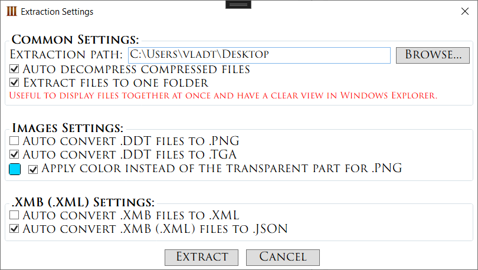

<!-- PROJECT LOGO -->
 

  

# Resource Manager

*Utility for viewing, comparing, creating and extracting files from Age of Empires III .BAR archive*

**Developer:** VladTheJunior and Kevsoft 
**Current version:** 0.4.7 

[Download Portable](https://github.com/VladTheJunior/Resource-Manager/releases/latest/download/ResourceManager.zip) 
[Download Installer from Google Drive](https://drive.google.com/file/d/1HQ1UzSThhSGhjUff-sMzQCcDyr6znxOU/view?usp=sharing) 

*__Note__: Portable version may require .NET6 desktop runtime: https://dotnet.microsoft.com/en-us/download/dotnet/6.0*

You can also join my discord server to stay up to date with the latest updates and news about my current developments and projects: [Commando Squad](https://discord.gg/egcZRKgj4q)

## Table of Contents
* [About the Project](#about-the-project)
* [Latest Changes](#latest-changes)
* [Screenshots](#screenshots)
* [License](#license)
* [Contact](#contact)
* [Acknowledgements](#acknowledgements)

<!-- ABOUT THE PROJECT -->
## About The Project

I would like to present to you a program for viewing, comparing, creating and extracting files from BAR archives of the Age of Empires 3: Definitive Edition (also supports AoE3 Legacy). This tool replaces the AoE3Ed Viewer developed by Ykkrosh, which does not work for the Definitive Edition.
The updated version includes all functions that were in AoE3Ed Viewer, as well as new features:

**Preview:**
* Syntax highlighting in previewing text files (xml, xs).
* Search in preview in text files (CTRL + F).
* Ability to scale and drag images in preview.

**Entries table:**
* Grouping files by their format (optional).
* Sort by name, size, creation date.
* Search in the BAR archive.
* Calculation of CRC (optional).
* The size of the selected entries.
* Detail of entry file.
* Copy path of entry to clipboard.

**Conversion:**
* Converting XML <-> JSON <-> XMB (both Legacy and DE).
* Converting DDT -> PNG.
* Converting DDT <-> TGA.

**Extract:**
* Extract all files.
* Extract selected files.
* Extract files to one folder.
* Extract from list of paths.
* Entries details as JSON.
* Exctract PNG with compression.
* Extract PNG as WEBP.

**Other:**
* Comparison of BAR archives.
* Create BAR archive from files and folders.

## Latest Changes

### Version 0.4.7
* Added TGA -> DDT conversion.
* Added the option to extract PNG images in WEBP format.
* Added the option to compress PNG images when extracting.
* Fixed a bug with color overlay on portrait images.
* Fixed a bug with storing extraction settings.

## Screenshots

<!-- LICENSE -->
## License

Distributed under the MIT License. See `LICENSE` for more information.

<!-- CONTACT -->
## Contact

VladTheJunior - Discord: VladTheJunior#1244 - VladTheJunior@gmail.com

Kevsoft/KevinW1998 - Discord: Kevsoft#1873

Project Link: [https://github.com/VladTheJunior/Resource-Manager](https://github.com/VladTheJunior/Resource-Manager)

<!-- ACKNOWLEDGEMENTS -->
## Acknowledgements
* [ProjectCeleste/ProjectCeleste.GameFiles.Tools](https://github.com/ProjectCeleste/ProjectCeleste.GameFiles.Tools)
* [PaulZero/AoE3-File-Readers](https://github.com/PaulZero/AoE3-File-Readers)
* [AoE3Ed by Ykkrosh](http://games.build-a.com/aoe3/files/)

Special thanks to:
* [Kevsoft](https://kevsoft.io/) for great contribution to the development.
* [Sebastien](https://github.com/systematicskid) for help in decrypting sounds.
* [Budschie](https://github.com/Budschie) for making changes to the usability of the GUI.
* __**AoE3 Modding Council**__ for supporting and testing the application.
