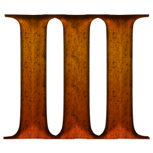
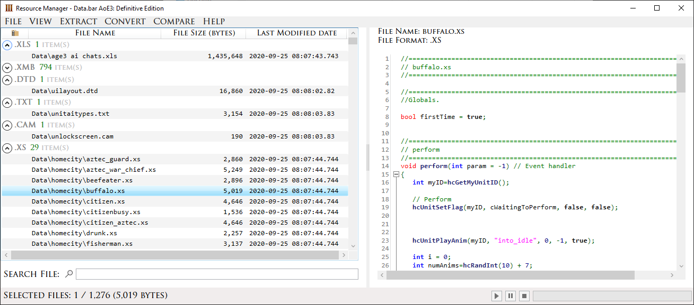
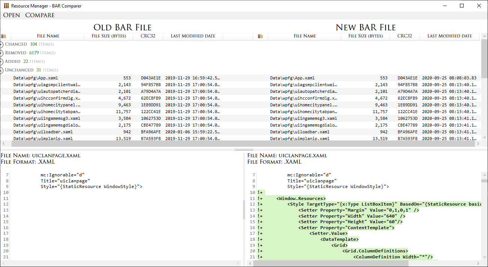

<!-- PROJECT LOGO -->
 

  

# Resource Manager

*Utility for viewing, comparing, creating and extracting files from Age of Empires III .BAR archive*

**Note by Kevsoft:** VladTheJunior will be inactive for a longer period of time and thus decided to transfer ownership to me, Kevsoft/KevinW1998. I will keep an eye out for issues and pull requests. 

**Developer:** VladTheJunior and Kevsoft 
**Current version:** 0.4.1 
[Download Portable (.zip archive)](https://github.com/KevinW1998/Resource-Manager/releases/latest/download/Resource-Manager.zip) 
[Download Standalone (.exe) (Outdated)](https://drive.google.com/file/d/19y7AeWME68FFv5sJeCsORIF5-mLHqCNX/view?usp=sharing) 

## Table of Contents

* [How to Use](#how-to-use)
* [About the Project](#about-the-project)
* [Latest Changes](#latest-changes)
* [Screenshots](#screenshots)
* [License](#license)
* [Contact](#contact)
* [Acknowledgements](#acknowledgements)

## How to Use

1. Download application from the link above.

### For Portable version

2. Unpack .zip and run *Resource Manager.exe*.
3. Application requires .NET Core. If you haven't installed it yet, you can download it from the direct link: [.NET Core Runtime](https://dotnet.microsoft.com/download/dotnet-core/thank-you/runtime-desktop-3.1.9-windows-x64-installer).

<!-- ABOUT THE PROJECT -->
## About The Project

I would like to present to you a program for viewing, comparing, creating and extracting files from BAR archives of the Age of Empires 3: Definitive Edition (also supports AoE3 2007). This tool replaces the AoE3Ed Viewer developed by Ykkrosh, which does not work for the Definitive Edition.
The updated version includes all **(x)** functions that were in AoE3Ed Viewer, as well as new features:

**Preview:**
* Syntax highlighting in previewing text files (xml, xs).
* Search in preview in text files (CTRL + F).
* Ability to scale and drag images in preview.

**Entries table:**
* Grouping files by their format (optional).
* Sort by name, size, creation date.
* Search in the BAR archive.
* Calculation of CRC (optional).
* The size of the selected entries.
* Detail of entry file.

**Conversion:**
* Converting XML <-> XMB (both 2007 and DE).
* Converting DDT -> PNG.

**Extract:**
* Extract all files.
* Extract selected files.

**Other:**
* Comparison of BAR archives.
* Create BAR archive from files and folders.

**(x) Currently the application does not include the following features:**
* Converting DDT <-> TGA (it is recommended to use [Photoshop Plugin by kangcliff](http://aoe3.heavengames.com/cgi-bin/forums/display.cgi?action=ct&f=14,39229,,10)).

## Latest Changes

### Version 0.4
* Added decryption of sounds (sound files can be extracted without problem now).
* Added new GUI for extraction dialog.
* Fixed bug with .xmb.xml extension while converted.
* Added entry details window (in context menu in entries table).

## Screenshots

<!-- LICENSE -->
## License

Distributed under the MIT License. See `LICENSE` for more information.

<!-- CONTACT -->
## Contact

VladTheJunior - Discord: VladTheJunior#1244 - VladTheJunior@gmail.com

Kevsoft/KevinW1998 - Discord: Kevsoft#1873

Project Link: [https://github.com/VladTheJunior/Resource-Manager](https://github.com/VladTheJunior/Resource-Manager)

<!-- ACKNOWLEDGEMENTS -->
## Acknowledgements
* [ProjectCeleste/ProjectCeleste.GameFiles.Tools](https://github.com/ProjectCeleste/ProjectCeleste.GameFiles.Tools)
* [PaulZero/AoE3-File-Readers](https://github.com/PaulZero/AoE3-File-Readers)
* [AoE3Ed by Ykkrosh](http://games.build-a.com/aoe3/files/)

Special thanks to:
* [Kevsoft](https://kevsoft.io/) for great contribution to the development.
* [Sebastien](https://github.com/systematicskid) for help in decrypting sounds.
* [Budschie](https://github.com/Budschie) for making changes to the usability of the GUI.
* __**AoE3 Modding Council**__ for supporting and testing the application.
